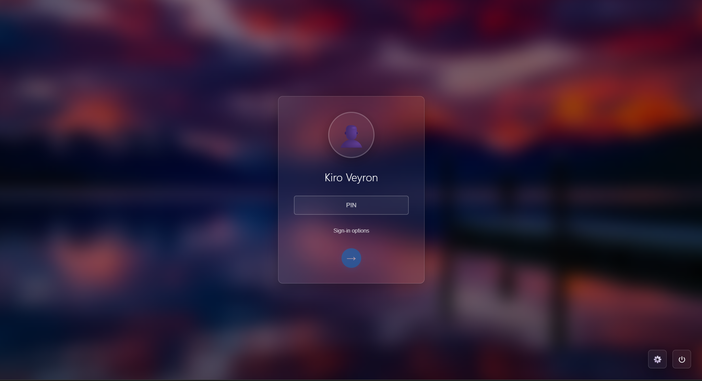
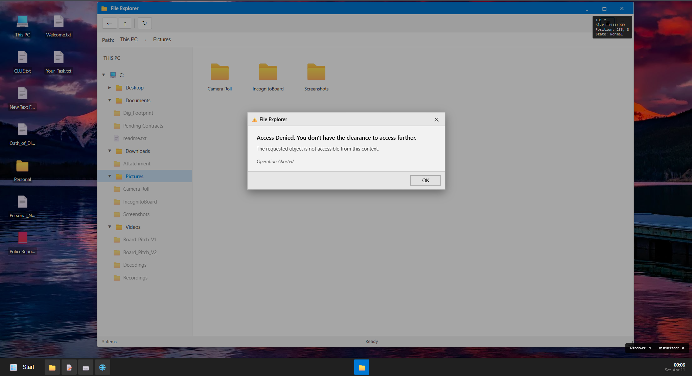
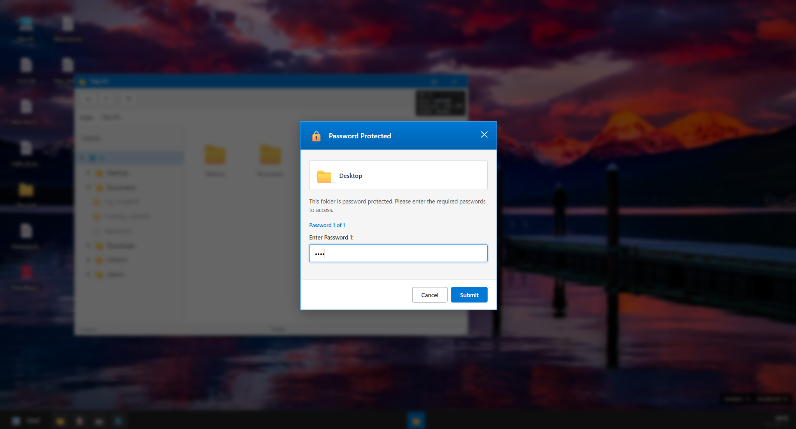
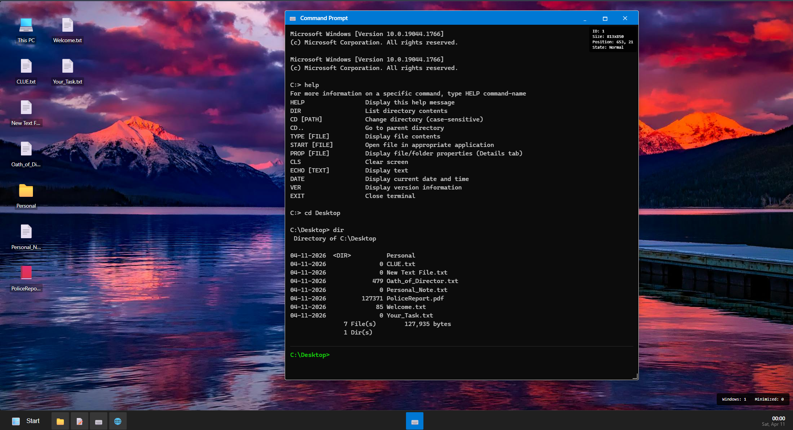
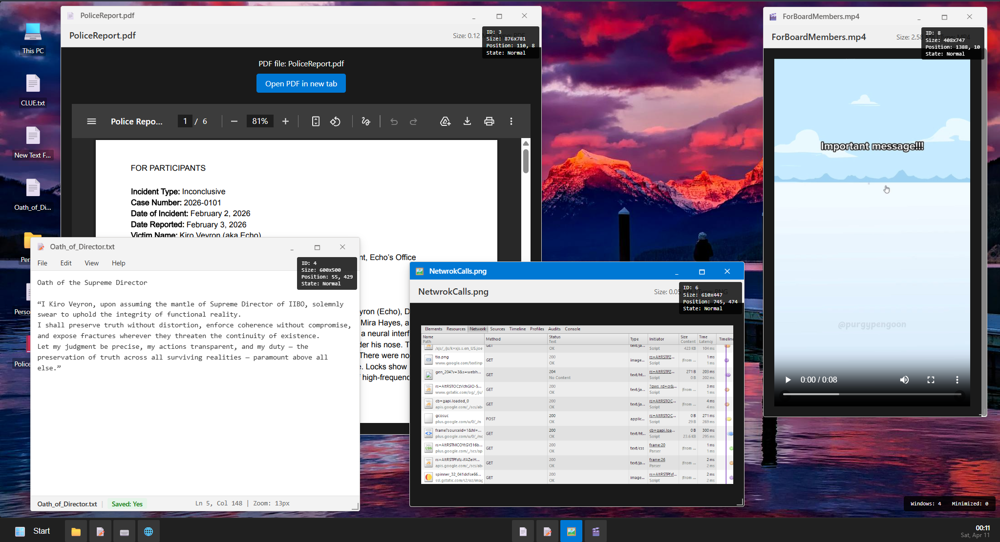

# Echo — IIBO Desktop Simulator - Incognito Investigation

A web-based desktop environment replicating Windows OS behavior with a virtual file system, command-line interface, and modular application system.



## Overview

A full-stack web application that simulates a Windows-style desktop environment, built as a puzzle-platform for **PROCOM'26 at FAST University** for a live investigative mystery module **Incognito Investigation**. Participants interact with a functional browser-based desktop that replicates Windows UI conventions: a file explorer, notepad editor, media viewer, terminal emulator, taskbar, start menu, and right-click context menus. Files, folders, and uploaded media are persisted in MongoDB and served via a Node.js backend. The application serves as the investigative interface through which participants access clue files, read documents, view images, and watch videos as part of a narrative mystery.

## Features

**Desktop Interface:**
- Fully interactive Windows-style desktop with draggable, resizable windows
- Taskbar with open application tracking and Start Menu navigation
- Right-click context menu with create, rename, delete, and properties options
- Wallpaper selection from a predefined collection (stored and persisted in MongoDB)

**File System:**
- Hierarchical virtual file system mirroring a Windows path structure (`C:`, `C:\Desktop`, `C:\Documents`, etc.)
- Folders and files stored as MongoDB documents with path-based navigation
- File types supported: `.txt`, `.cpp`, `.jpg`, `.png`, `.gif`, `.mp4`, `.avi`, `.mov`, `.pdf`
- File upload via multer (up to 50MB per file)

**Applications:**
- **Notepad:** View and edit `.txt` and `.cpp` files with content saved to MongoDB
- **File Explorer:** Browse the virtual file system, navigate into folders, open files
- **Media Viewer:** View images (jpg, png, gif) and play video files (mp4, mov, avi) and PDFs inline
- **Terminal:** Command-line interface with commands: `dir`, `cd`, `type`, `start`, `prop`, `cls`
- **Properties Panel:** View file metadata including owner, size, and additional properties

**Access Control:**
- Sign-in screen with password authentication (env-configured)
- File-level password locking: individual files can require one or more passwords to access, validated server-side in sequence
- Separate environment-controlled codes for save (`SAVE_CODE`), rename (`RENAME_CODE`), and delete (`DELETION_CODE`) operations

**Admin/Content Setup:**
- Default file system structure is seeded on server startup (Desktop, Documents, Pictures, Videos, Downloads + sample files)
- Files are uploaded via the backend's `/upload` endpoint and stored on disk; metadata persisted in MongoDB

## Tech Stack

**Frontend:** React, JSX, CSS Modules

**Backend:** Node.js, Express.js

**Database:** MongoDB (Mongoose ODM)

**File Uploads:** Multer (disk storage, 50MB limit)

**Environment:** dotenv

**Deployment:** Render

## System Design / Working

**Backend (`server.js`):**

Two Mongoose schemas power the system: `File` (stores file metadata, content, path, type, MIME type, size, password lock settings, and a `filePath` pointer to the physical upload) and `Wallpaper` (stores current and available wallpaper URLs).

The file API follows a RESTful design:
- `GET /api/files?path=C:\Desktop` — returns all files in a given virtual path
- `POST /api/files/text` — creates a new text file
- `POST /api/files/folder` — creates a new folder
- `POST /api/files/upload` — handles binary file uploads via multer
- `PUT /api/files/:id` — saves content updates
- `PUT /api/files/:id/rename` — renames a file, enforces same-extension rule
- `DELETE /api/files/:id` — deletes a file (requires `deletionCode`)
- `POST /api/files/validate-password` — validates a sequential array of passwords against `passwordKeys`
- `GET /api/files/:id/content` — serves file content or streams physical file

**Password Locking:**

When a file has `passwordLocked: true`, its `passwordKeys` array holds an ordered list of required passwords. The client submits an array of entered passwords; the server validates length and each value in sequence, returning `failedAtIndex` if any fails.

**Frontend Component Architecture:**

```
App.js
├── SignInPage          → password-gated entry
└── Desktop             → main shell
    ├── Taskbar         → open window list + clock
    ├── StartMenu       → app launcher
    ├── DesktopIcon     → shortcut icons on desktop surface
    ├── ContextMenu     → right-click actions
    └── Window          → generic resizable/draggable window frame
        ├── FileExplorer
        ├── Notepad
        ├── MediaViewer (images, videos, PDFs)
        ├── Terminal
        ├── Properties
        ├── PasswordAccess
        └── Error
```

**Terminal Commands:**

The Terminal component parses typed commands and queries the file API or updates local state:
- `dir` — lists files in the current path
- `cd <folder>` — navigates into a subfolder
- `type <file>` — reads and displays text file content
- `start <file>` — opens a file in its associated viewer
- `prop <file>` — shows file properties
- `cls` — clears the terminal output

## Screenshots

- "File Explorer navigating the virtual Windows directory tree only 1 sub level, otherwise Access Restricted"

- "Password-locked folder access prompt with sequential key validation"

- "Terminal emulator executing `help` and `cd` commands, and displaying other commands that can run"

- "Displaying all the types of windows that can open [Text, PNG, MP4, PDF etc]


## Deployment

Live Demo: [https://echo-iibo-desktop.onrender.com/]

> Note:
> This project is deployed on the free tier of Render. Due to ephemeral disk storage, uploaded files (images, videos, PDFs) are not persistently stored and may not load correctly after server restarts.
> 
> For full functionality, including proper media handling and file persistence, run the application locally.

## How to Run Locally

```bash
# Clone the repository
git clone <repo-url>
cd Echo_IIBO_Desktop

# Backend setup
cd backend
npm install

# Create .env file
echo "MONGODB_URI=<your_mongo_uri>
SIGN_IN_PASSWORD=1724
SAVE_CODE=<your_save_code>
RENAME_CODE=<your_rename_code>
DELETION_CODE=<your_deletion_code>
PORT=5000 
FRONTEND_URL=https://localhost:3000" > .env

npm start

# Frontend setup (new terminal)
cd ../client
npm install
npm start
```

## Folder Structure

```
Echo_IIBO_Desktop/
├── backend/
│   ├── server.js          # All API routes, Mongoose schemas, multer config
│   ├── uploads/           # Persistent uploaded files (populated at runtime)
│   └── package.json
└── client/
    └── src/
        ├── App.js
        └── components/
            ├── Desktop.jsx        # Main shell + window management
            ├── FileExplorer.jsx   # Directory browsing
            ├── Notepad.jsx        # Text/code editor
            ├── MediaViewer.jsx    # Image, video, PDF viewer
            ├── Terminal.jsx       # CLI emulator
            ├── Window.jsx         # Draggable/resizable window container
            ├── Taskbar.jsx
            ├── StartMenu.jsx
            ├── ContextMenu.jsx
            ├── Properties.jsx
            ├── PasswordAccess.jsx
            ├── SignInPage.jsx
            └── Error.jsx
```
## My Role

Primary developer responsible for the complete design and implementation of the platform.

- Architected and developed the browser-based desktop simulation, including backend systems and frontend interface
- Designed the virtual file system with path-based hierarchy and file handling for both text and binary data
- Implemented REST APIs for file operations, command execution, and access control mechanisms
- Built core frontend components including File Explorer, Notepad, Media Viewer, and Terminal emulator
- Developed the window management system with draggable/resizable containers, taskbar, and context menus

Deployment and final hosting setup were carried out with assistance from Abdul Ahad.
